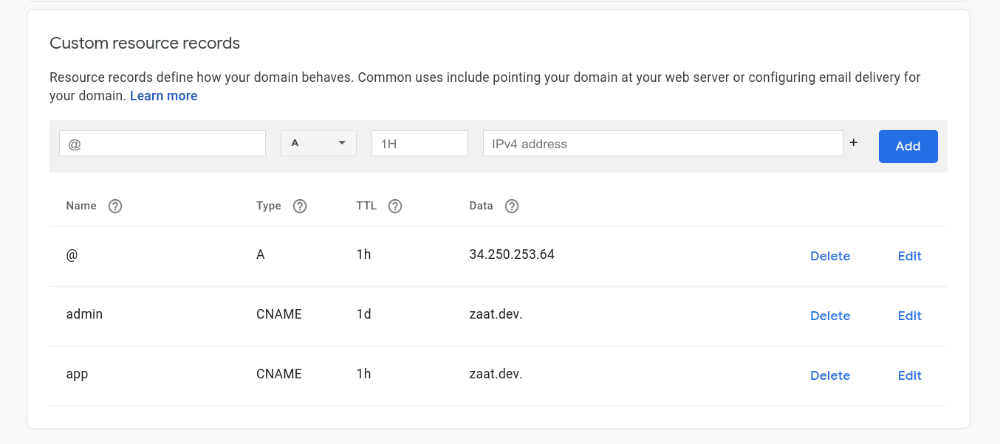

We, at Zaat.dev host multiple websites and applications on a single instance. Yeah, it may seem a little bit confusing to call it an “instance” or "dyno"(heroku) even if you’re into OOP, it’s like taking the OOP concept to a whole new level. That’s why terminology is a crucial thing, one should master, regarding their field of specialization, and to be aware of how tricky words can be, this is why scientists invent long weird terms, as they prefer to create complicated terms instead of simple conflicting ones.

So here, an instance _is a Linux run environment (bash terminal), that is supposed to be available 24/7 while maintaining its static IP address_.
An instance can be rented from [AWS](https://aws.amazon.com/), [Azure](https://azure.microsoft.com/en-us/), or [GCP](https://cloud.google.com/). They have almost the same pricing, unless your company is big enough to have a couple of those men in suits, you may have a chance to cut a deal with them to get a better price!

Now and after defining what an instance means, we’ll go over the three main layers, as a **top to bottom approach**, then I will introduce some trivial code snippets but starting from as a **bottom to top**.

### Domain Name Servers: First Layer

You can consider the domain name servers as a phone contacts app, through it, you can store your family members and friends numbers, so whenever you want to reach them out, you just type their names and give them a call. This feature is basic but important and any domain you buy should support it.
Nowadays, things got a little bit complicated by dropping the old fashion “www” from websites’ addresses, even though you still can have the same domain name with different prefixes. Going back to our ref example, the phone contacts app, is there any chance that this app doesn't support adding multiple phone numbers in a single contact!

So, let's say that you have several subdomains like “mail.example.com”, “app.example.com”, etc and you want these subdomains to point to your main domain name “example.com”, you can do this by using the CNAME record. As mentioned before, it is exactly like the phone contacts app, where you can add multiple phone numbers in a single contact under different labels, e.g: work, home, etc.

Domain names are an extra layer added over a typical IP layer, so when users want to visit a site they don’t have to memorize numbers -IPs-, just like phone numbers! Each time you want to call someone, you just type their name on the phone contacts app without worrying about what their actual phone number is. However, domain names are registered across the web and distributed around the globe. Each registry has two main values: the IP “32.34.23.34” and a corresponding domain name “zaat.dev”. So when you type in a URL, the browser looks up the IP address for the domain name, then the browser sends a request to the server, the server sends back a response, if everything is OK the browser then redirects the request to the second layer…

### Nginx: Alternative Apache

[Nginx](https://nginx.org) is the main gate for the instance, Nginx is like a traffic officer, its main role is to direct the request according to thier CNAME, URL, etc. to its destination in our instance.

To make it clearer, consider Nginx as a help desk for an organization that redirects requests to the right destination.(nginx usually does that mainly by matching the host name or CNAME with the first server block). If the requests were simple, Nginx can directly reopens to them (e.g. serving static files). Otherwise, Nginx can proxy the requests to a localhost server, it can be a node app, Django, Java enterprise, or any other localhost server you are running.

Since Nginx is our main gate, it makes sense to let it handle the encryption layer, i.e. https. Frounttently, [certbot](https://certbot.eff.org/)(built on top of the amazing open source tool [openssl](https://www.openssl.org/)) does that out of the box, as soon as you set the basic configuration for Nginx. Certbot can transform all of your http to https in just one command line.

Other features Nginx may offer, or that it is commonly used for, is to intervene with request headers. For example, Nginx could add geolocation headers for each request by interrupting the requested IP address. Then, it can for example redirect it to a localized version of the app/site or set specific headers accordingly.

### Third Layer: Local Server, File System, a Containerized App

In this layer, we handle the services or local servers which Nginx has proxy . At Zaat.dev, almost all of our apps are node-based, so it’s easy to manage the running app using [pm2](https://pm2.keymetrics.io/).

### Let’s get our hands dirty! (Bottom-up)

### First Layer: pm2/built files

Pm2 could be used in a simple or sophisticated way. Let’s assume you have nodejs app, which definitely has “package.json” with a start script, all what you need to do with pm2 is to let it run is:

```bash
pm2 start --name myapp "node start" // you can pass port number here, otherwise pm2 take app default, lets assume port is 5000 here
```

Alright, now suppose, you have static website, no matter which framework it is based on,usually static sites are built before being deployed, and once built it usually at files are put in a specific directory. Let's assume your site has build script in `package.json`, and its output directory is `/build`

```bash
npm run build // directory is site_root/build
```

### Second Layer: Nginx

Now that we have a static site built and another app running on localhost, we can set the configuration of nginx as follows:

Note: usually the default configuration file for (ubuntu) is
`etc/ngnix/conf.d/default.conf` // this what we are editing next.
But don't confuse with the other configuration file `/etc/nginx/nginx.conf `,
which usually seems to be used for parent or top level configuration like logs..etc
Also notice that my nginx.conf file has an important statement in it's http block:
{
// some configuration, max file size, type and logs..etc
`include /etc/nginx/conf.d/*.conf;`
}
This means all the files `/conf.d` which has the `.conf` extension, read them and use them as configuration.

Now back to the other configuration file, we are adding this server block:
Which means whenever we get a request with hostname app.example.com, proxy it local server at port 5000

```nginx
server {

    server_name app.example.com;

    location / {
         proxy_pass http://127.0.0.1:5000;

        }

}
```

And for the site we can do something like:

```nginx
server {

    server_name .exaxmple.com www.example.com;
    root /home/ubuntu/site_root/build;
    location / {
           index: index.html // path is relative to the root
    }

}
```

Now, that your configuration is ready, you can restart the nginx, by running
First make sure no syntax error in configuration, we run:

```bash
sudo service nginx reload
```

Re starting nginx with the tested configuration by previous step.

```bash
sudo service nginx restart
```

**Note:** It's importnat each time you change the nginx configuration to run `reload` first, otherwise all your servies may be down until you fix a syntax error!.

Lastly, as mentioned before, certbot can easliy add an encryption layer for all the servers that are handled by nginx. you just need to tell it you are using nginx, then it reads the its configuration file, check which domain name are setted then asked you accordingly which one of them you want to add encryption layer for..etc
On success, certbot rewrite the configuration file accordingly, e.g. setting path of generated key pairs...

Im summary it could be as easy as this, refer to this [doc](https://certbot.eff.org/instructions) for more information.

```bash
sudo certbot --nginx
```

Alright, at this point we are done with the instance in the shell/bash level, but before setting the domain name, you need to make sure your instance is running on a static ip and to get it. With AWS this is easy, you would need allocate an elastic ip address then assign/assoicated it to the running instance.
Let's assume our static ip address is "34.250.253.64"

### Third layer: Domain Name

First thing first, is to tell your domain register service, is to direct all requests (root) to the ip address, each configuration setting is called a _record_

So add an 'a' record to with the ip address, in our case "34.250.253.64"
Add a cname record, called 'app' and redirects to the root, first record.

Note: you can set the `www` direction at the domain name level or at the nginx level, though you did it at nginx I think it would redirect faster if at the domain level.

Here is how the configuration may look like, if you are using google domain: (ignore the admin record).



Lastly and more importantly: You can make other sites (domain names) listen to your instance/ the nginx server, simply by setting their root ip same as the original level, and then adding a new server block in nginx configuration accordingly.

### The more I know the less I know...

**Note:** This may not be the best approach, i.e. running all of your apps under a single instance, consider the situation of which while you are trying to update an app but you have to upgrade node before, but other apps are dependent on the current specific version!..etc And this I guess is where Docker/Kubernates should play a critical role, hope this may be a story for another day..

Thank you for your time, hope this article was useful for you, happy to answer your question or to hear your suggestion, you can use the link below to comment on github.

I want also to take the chance to thank our content creator [Abeer Albada](https://github.com/AbeerAlbada) for helping me put my word together in the first part of this article. Much appreciate Abeer!.
